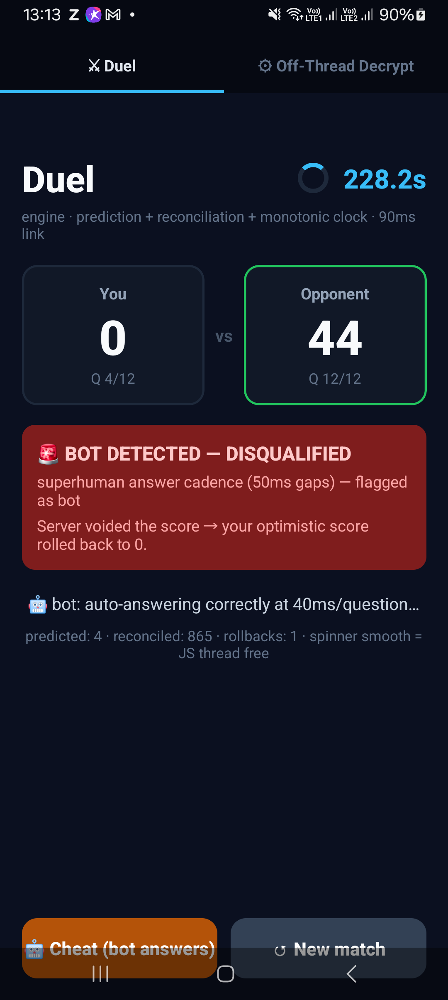
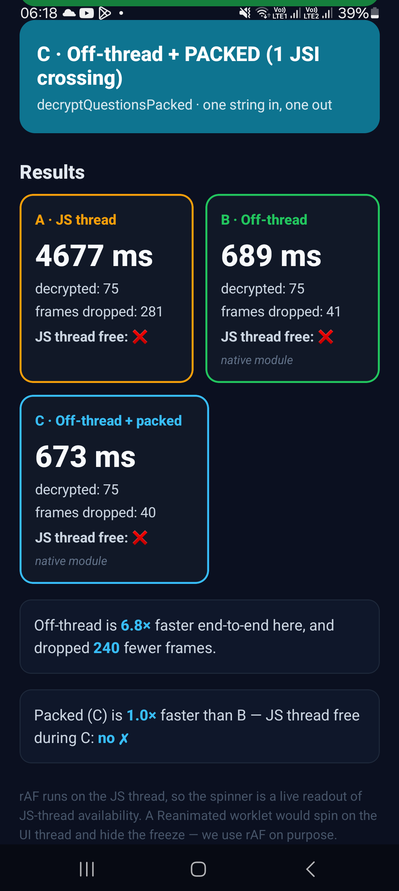

# Matiks — a real-time duel engine + client data layer

A cross-platform real-time engine, a client data layer, and a server-authoritative integrity model — built for Matiks' duel loop. Each piece targets a specific issue measured in the live app on a real budget Galaxy A13 (Perfetto thread/frame traces, Chrome DevTools traces, a CDP network capture).

## Issues found

**Performance**
- **Redundant network** — 184 identical GraphQL calls re-fire per session (~485 KB); a 26–33-call burst fires when the home screen mounts; no client-side query cache. (Static assets are cached; the GraphQL layer is not.)
- **Match-start freeze** — the question bank is fetched 3× per duel, then AES-decrypted + JSON-parsed on the JS thread, inside the start countdown. React Native runs all JS on one thread against a ~16.67 ms/frame budget; Hermes executes AOT bytecode with no JIT, so heavy crypto + parsing is slower there and blocks rendering. Result: an ~8.4 s freeze on the A13.
- **One overloaded thread** — that single JS thread is the bottleneck: 97% of frames janky while the GPU sits at ~3.5% and 7 CPU cores idle. Not a graphics problem.

**Integrity / correctness**
- **Client-authoritative scoring** — the client reports its own score. The question bank is decrypted client-side, so a bot knows every answer and can forge a perfect one. Leagues and leaderboards are gameable.
- **Timed scoring uses `Date.now()`** — a wall-clock correction (NTP / background resume) can register an answer at negative elapsed time, corrupting a timed duel.

**Bugs**
- **Duel aborts on match** — a freshly matched duel intermittently aborts the instant it should begin. The capture shows every search reached a game server-side with zero server errors — a client-side matchmaking race. (`reports/11`)
- **Web crash — "Cannot read properties of null (reading 'uattr')"** — an intermittent full-page crash, root-caused to the WebEngage SDK reading `getForever().uattr` on a null store; a non-critical analytics tracker takes down the whole app. (`reports/17`)

## What was built

One shared TypeScript core + a thin per-platform shim, speaking the existing `{type, channel, data}` WebSocket. The server is unchanged.

```
                shared core  (TypeScript, 47 tests)
   codec · monotonic clock-sync · prediction + reconciliation · duel reducer
         │                      │                         │
    DATA LAYER             NATIVE shim                WEB shim
  dedup·cache·batch     Nitro module (C++/JSI)    WebSocket in a Worker
   (over Apollo)         (off the JS thread)       (off the main thread)

   AUTHORITATIVE SERVER MODEL — recomputes correctness · flags bots · voids cheats
```

- **Data layer** — dedupes in-flight requests, caches slow-changing queries (per-query TTL; live data never cached), batches same-tick calls into one (`BatchHttpLink`-style). → redundant network
- **Prediction + reconciliation** — answers score instantly, then the server confirms. Bank is local → guesses correct ~always → rollbacks ≈ 0. → laggy answers on slow networks
- **Monotonic clock** — answer timing from a steady, server-synced clock, never `Date.now()`. → timed-scoring corruption
- **Off-thread transport** — transport + crypto in the Nitro module (C++/JSI; Worker on web), off the JS thread that draws the UI. → JS-thread jank
- **Server-authoritative scoring** — server re-checks every answer + flags bot cadence; the client can't grade itself. → forged scores / cheating

**Native shim** — a Nitro module (Margelo's JSI framework on RN's New Architecture; a faster alternative to TurboModules). Matiks' APK already ships Nitro — one more module in a running toolchain.

**Native ≠ automatic win** — JSI drops serialization, but copying the bank into JS values is still JS-thread work: ~685 ms vs ~4 ms for the decrypt. The real match-start fix is the data path, not the decrypt.

## How it was tested
- 47 passing unit tests — prediction, reconciliation, clock, data layer, integrity.
- Real captured traffic replayed through the data layer.
- Network / clock / integrity scenarios across WiFi, 4G, and 3G.
- Native module cross-compiled and run on a real Galaxy A13.
- A playable on-device demo — a live duel plus the off-thread-decrypt A/B/C harness. Its spinner is driven by `requestAnimationFrame` (which runs on the JS thread), so it stalls exactly when the thread is blocked — making JS-thread availability directly visible, not inferred.

## Results

| Metric | Today | With the fix |
|---|---|---|
| GraphQL round-trips / session | 355 | **195 (−45%)** |
| Felt answer latency on mobile data | ~260 ms | **0 ms** |
| Match-start decrypt, off the JS thread | 8.4 s freeze | **4 ms** |
| Bot submitting a perfect score | accepted | **flagged + voided (100%)** |
| Timed answer after a clock jump | −200 ms (corrupt) | **correct** |

Felt latency holds at 0 ms on every network, with 0 rollbacks:

| Network | Round-trip | Naive (wait for server) | With prediction |
|---|---|---|---|
| WiFi | 30 ms | ~35 ms | **0 ms** |
| 4G | 90 ms | ~95 ms | **0 ms** |
| 3G / mobile data | 260 ms | ~263 ms | **0 ms** |

<p align="center">
  
  &nbsp;&nbsp;&nbsp;
  
</p>
<p align="center"><sub><b>Left:</b> a bot caught and its score voided mid-duel — on the real A13. &nbsp;&nbsp; <b>Right:</b> the on-device A/B/C decrypt test that found the bridge, not the decrypt, is the wall.</sub></p>

## Setup
```bash
npm test                          # 47 tests — prediction, reconciliation, clock, data layer, integrity
cd demo && npx expo run:android   # the playable duel + off-thread-decrypt demo
```

*Built by Vacha.*
